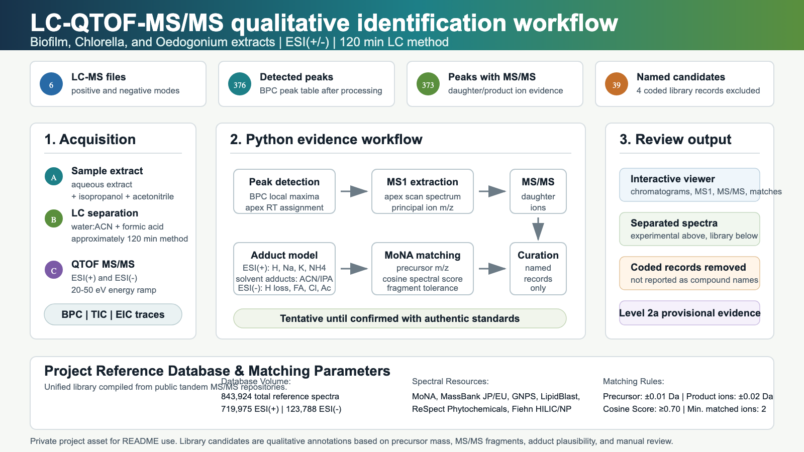

# 🔬 LC-QTOF-MS/MS Evidence Reviewer

Custom HTML visualizer for qualitative review of LC-QTOF-MS/MS samples processed in this private project.

This repository is a static, reproducible, easy-to-open viewer for reviewing chromatograms, raw MS1/MS2 spectra, and library candidates from the processed samples.

---

## 📈 Identification Workflow



The workflow converts raw LC-QTOF-MS/MS data into tentative qualitative annotations. The reported candidate counts exclude unknown features and coded library records that do not provide clean chemical compound names. The editable SVG source is stored in `assets/identification_workflow_infographic.svg`.

---

## 📚 Spectral Library & Compilation

The visualizer's sample data is matched and annotated using the project's consolidated reference database:

```
MoNA LC-MS/MS MSP export + 18 MS-DIAL Public MSP Libraries
  |
  +--> Total Precursor-Indexed Records: 843,924
  |
  +--> ESI(+) Compatible Standards: 719,975 (MoNA + GNPS + PlaSMA + LipidBlast + Fiehn + ReSpect + bmdms-np + Riken)
  +--> ESI(-) Compatible Standards: 123,788 (MoNA + MassBank + FiehnHILIC + PlaSMA + LipidBlast + Respect + Riken)
```

### Supported Libraries:
- **MassBank JP & MassBank EU** (Positive and Negative ionization modes)
- **ReSpect** (Phytochemicals from plants and algae)
- **GNPS** (Natural products and microbial metabolites)
- **PlaSMA & Fiehn HILIC** (Central metabolomics)
- **LipidBlast** (ExpBioInsilico: massive computational lipid database)
- **bmdms-np** (BioMetabolome natural products)
- **RikenOxPLs** (RIKEN oxidized phospholipids)

*Note: The visualizer displays the exact source file (e.g. `MSMS-Pos-GNPS.msp`, `MSMS_Public_ExpBioInsilico_Pos_VS17.msp`) inside the compound identification card for complete traceabilty.*

---

## 🚀 Open the Visualizer

Open the main HTML file in a new browser tab:

👉 **[Open Live Visualizer Website](https://davinson-pezo.github.io/visualizer-lc-ms/)**

### Opening it locally (No Server Required):
1. Navigate to the `visualizer/` folder.
2. **Double-click `index.html`** or drag it into Chrome, Safari, Firefox, or Edge.
3. The visualizer will load the processed data from `data/*.js` and Plotly from `vendor/`.

*Note: Bypasses CORS browser blockages on `file://` by using dynamic script tag injection in `app.js` instead of `fetch()` requests. No Python or local server is required.*

---

## 🧪 Included Samples

The visualizer contains processed data from three sample types, acquired in positive and negative ionization mode:

- **Biofilm**: Biofilm sample.
- **Chlorella**: Microalgal biomass sample (*Chlorella*).
- **Oedogonium**: Algal biomass sample (*Oedogonium*).

### Experimental Conditions:
- **Chromatography**: 120 min chromatographic method with water:acetonitrile mobile phase acidified with formic acid.
- **MS/MS**: Collision energy ramp of 20-50 eV (exact collision energy applied to each scan is a global instrumental ramp).

---

## ⚖️ Adduct Model

The visualizer reports an assumed or inferred adduct and a calculated neutral mass:

| Polarity | Adduct | Interpretation | Neutral Mass Calculation |
| --- | --- | --- | --- |
| ESI(+) | `[M+H]+` | protonated molecule | `M = m/z - 1.007276` |
| ESI(+) | `[M+Na]+` | sodium adduct | `M = m/z - 22.989218` |
| ESI(+) | `[M+K]+` | potassium adduct | `M = m/z - 38.963158` |
| ESI(+) | `[M+NH4]+` | ammonium adduct | `M = m/z - 18.033823` |
| ESI(+) | `[M+ACN+H]+` | acetonitrile cluster | `M = m/z - 42.033823` |
| ESI(+) | `[M+IPA+H]+` | isopropanol cluster | `M = m/z - 61.064791` |
| ESI(+) | `[2M+H]+` | protonated dimer | `M = (m/z - 1.007276) / 2` |
| ESI(-) | `[M-H]-` | deprotonated molecule | `M = m/z + 1.007276` |
| ESI(-) | `[M+FA-H]-` | formate adduct (formic acid) | `M = m/z - 44.998201` |
| ESI(-) | `[M+Cl]-` | chloride adduct | `M = m/z - 34.969402` |
| ESI(-) | `[M+Ac-H]-` | acetate adduct | `M = m/z - 59.013851` |
| ESI(-) | `[2M-H]-` | deprotonated dimer | `M = (m/z + 1.007276) / 2` |

---

## 🛠️ Main Features

### 1. Interactive 3D Peak Map
- Alternates between the **Spectra View** and the **3D Peak Map**.
- Renders the raw MS1 points (Retention Time vs $m/z$ vs Intensity) around the peak apex in an interactive 3D scatter plot powered by **Plotly.js**.
- Custom neon gradient colors (Cyan ➔ Magenta ➔ Gold) with full rotation, zoom, and inspection capabilities.

### 2. Live Co-elution & Adduct Panel
- Automatically scans for other peaks eluting within a $\pm 9$-second chromatographic window.
- Evaluates molecular relations in real time:
  - *Adduct relationships* (e.g. `[M+Na]+` vs `[M+H]+`, `[M+HCOO]-` vs `[M-H]-`).
  - *Isobaric formula exchanges* (such as $\text{CH}_4 \leftrightarrow \text{O}$ at $\Delta 0.036$ Da).
- If a peak is chromatographically isolated, it displays: *"No co-eluting features detected at this RT... elutes as an isolated single species."*

### 3. Dual Spectra Viewer
- Shows the **Experimental MS/MS** spectrum on top and the **Library Reference** spectrum on the bottom to prevent confusing mirrors or overlaps.
- Lists the matched fragment ions in an interactive table showing $\Delta m/z$ errors.

### 4. Peak Table & Detail Panel
- Filter peaks by: *All peaks*, *Only MS/MS library candidates*, or *Only peaks with MS/MS*.
- Full search functionality and links to external databases: PubChem, GNPS, HMDB, and MassBank.
- Export selected MS2 spectrums as `.msp` files.

---

## 🧬 Scientific Interpretation

The displayed candidates are qualitative annotations. A library candidate is a tentative annotation. The safest interpretation requires agreement between precursor mass, MS/MS fragments, adduct plausibility, chromatographic coelution, and library metadata.

---

## ⚠️ Coded Library Records

Some public records contain database, submission, or registry codes (e.g. `CCMSLIB...`). The viewer keeps the original library record for traceability, but it flags these cases as `coded library record` and adds a warning indicating that the result should be treated as a tentative spectral annotation, not as a confirmed compound name.

---

## 📂 Folder Contents

```text
visualizer/
  index.html                                # Main visualizer HTML
  app.js                                    # Frontend application logic
  style.css                                 # Glassmorphism dark-mode styles
  .nojekyll                                 # GitHub Pages bypass
  README.md                                 # This document
  assets/
    identification_workflow_infographic.png # Infographic image
    identification_workflow_infographic.svg # Infographic vector source
  data/                                     # JavaScript data packages
    Biofilm 1a _2_1_5194.js                 # Sample Biofilm ESI(+)
    Biofilm1 ESI-_2_1_5201.js               # Sample Biofilm ESI(-)
    Chlorella_4_1_5198.js                   # Sample Chlorella ESI(+)
    Chlorella ESI-_4_1_5203.js              # Sample Chlorella ESI(-)
    Oedogonium_3_1_5196.js                  # Sample Oedogonium ESI(+)
    Oedogonium ESI-_3_1_5202.js             # Sample Oedogonium ESI(-)
  vendor/
    plotly-2.24.1.min.js                    # Local Plotly.js plotting library
```

*Do not add or upload raw mzML files, full MSP libraries, intermediate results, or `.DS_Store` files to this folder.*

---

## 🔒 Use in a Private GitHub Repository

This visualizer is ready for GitHub Pages. You can upload the `visualizer/` contents into your repository and enable Pages from:
- The repository `/root`.
- The `/docs` folder.

If the repository is made public, the `data/*.js` files will also become public.

---

## ⚙️ Technical Notes

- The viewer does not use a backend.
- Plotly is bundled locally in `vendor/`; no internet connection or CDN is required.
- Data are loaded through relative paths from `data/*.js`.
